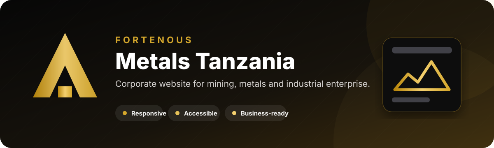

<p align="center">
  
</p>

<p align="center">
  <a href="https://nuru999.github.io/FORTENOUS-METALS/"></a>
  
  
  
</p>

## Overview

This repository contains the official corporate website project for **Fortenous Metals Tanzania Company Limited**, a Tanzanian mining, metals, and industrial enterprise.

The website translates the company profile into a modern digital presence that clearly presents the business, services, values, and contact channels across desktop and mobile devices.

> **Live website:** [nuru999.github.io/FORTENOUS-METALS](https://nuru999.github.io/FORTENOUS-METALS/)

## Business goals

- Establish a credible and professional online presence.
- Explain the company mission, values, and service areas clearly.
- Give potential clients and partners an easy way to understand the business.
- Present corporate information consistently across mobile, tablet, and desktop.
- Create a maintainable foundation for future documents, licences, projects, and enquiries.

## Website pages

| Page | Purpose |
| --- | --- |
| **Home** | Company introduction, values, services preview, commitments, and calls to action |
| **About** | Company overview, mission, vision, values, and corporate background |
| **Services** | Mining, metals, industrial, and supporting business activities |
| **Contact** | Contact information, business hours, enquiry form, and location details |

## Design and experience

- Premium dark interface with gold accents aligned with the metals industry.
- Responsive layouts using CSS Grid and Flexbox.
- Fixed navigation with a mobile menu.
- Scroll reveals, hover states, counters, and subtle motion.
- Semantic HTML, clear hierarchy, and accessible interactive controls.
- Lightweight static architecture suitable for GitHub Pages and other CDN hosting.

## Technology

| Layer | Implementation |
| --- | --- |
| **Structure** | Semantic HTML5 |
| **Styling** | CSS custom properties, Grid, Flexbox, responsive breakpoints, and animations |
| **Interaction** | Vanilla JavaScript ES6+ |
| **Icons** | Font Awesome |
| **Hosting** | GitHub Pages |

## Project structure

```text
FORTENOUS-METALS/
├── index.html
├── about.html
├── services.html
├── contact.html
├── css/
│   └── style.css
├── js/
│   └── main.js
├── images/
└── assets/
    └── fortenous-banner.svg
```

## Run locally

No build step is required.

```bash
git clone https://github.com/nuru999/FORTENOUS-METALS.git
cd FORTENOUS-METALS
python -m http.server 8000
```

Open [http://localhost:8000](http://localhost:8000) in a browser.

You can also open `index.html` directly or use the VS Code Live Server extension.

## Deployment

The `main` branch is published through GitHub Pages. After a deployment:

1. Check navigation on desktop and mobile.
2. Test every call-to-action and contact link.
3. Confirm images load using the exact filename capitalization.
4. Verify the contact form behaviour.
5. Review the site on a slow mobile connection.

## Corporate documents and licences

Licences and registration documents can strengthen the company website when they are presented carefully.

- Publish clear scans or verified summaries only after company approval.
- Redact signatures, private identification numbers, payment details, and other non-public information.
- Show the document name, issuing authority, issue date, validity status, and an optional verification reference.
- Keep expired or replaced documents out of the main public gallery.
- Use compressed PDF or WebP files so the website remains fast.

## Current scope

The website is static. The enquiry form currently provides frontend interaction only; production email delivery requires a trusted form service or a small backend endpoint.

Future business updates can add a project gallery, document centre, news section, multilingual content, and secure enquiry processing.

---

<p align="center">
  Website project developed by <a href="https://github.com/nuru999">Nuru Amudi</a>.
</p>